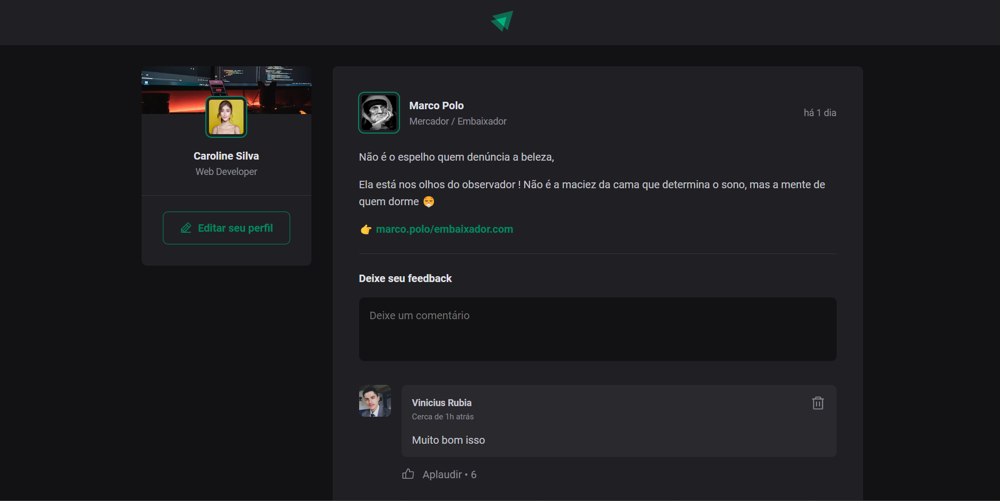

# Ignite Feed

Esse projeto é um feed que lista posts e comentários, podendo realizar um comentário à postagem e curtir o post que nesse projeto seria os "aplausos".


Você pode ver o projeto funcionado aqui: [Ignite Feed](https://feed-ignite-rockeatseat.vercel.app/)

## Layout




## 🚀 Começando

Pra começar, primeiro clone o repositório do projeto pra sua máquina

```
$ git clone https://github.com/Vinicius-Rubia/Feed-Ignite-Rockeatseat.git
```

## ⚙️ Iniciando o Projeto

Para iniciar, execute os seguintes comandos em seu terminal:

```
$ cd Feed-Ignite-Rockeatseat -> Mudar para o diretório do projeto
```

```
$ npm install -> Instalar todas as dependências

ou então...

$ yarn -> Instalar todas as dependências
```

```
$ npm run dev -> Iniciar o projeto

ou então...

$ yarn run dev -> Iniciar o projeto
```
Creditos: Design utilizado no projeto foi criado pela Rockeatseat

⌨️ com ❤️ por [Vinicius Rubia](https://github.com/Vinicius-Rubia) 😊
